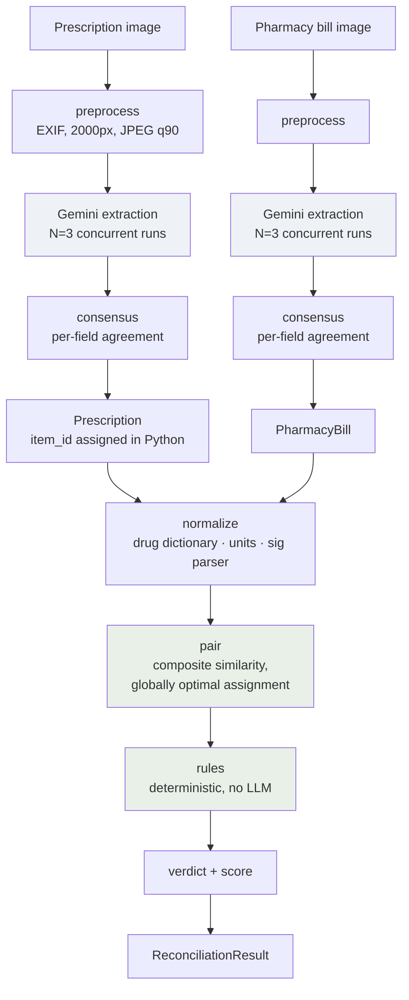

# rxconcile

Reads a handwritten doctor's prescription and a pharmacy bill, extracts structured
data from both, and reports whether the medicines dispensed match what was
prescribed.

**Proof of concept. Not a medical device. It reports document discrepancies only —
no medical advice, no dosing recommendations, no clinical judgement. Every finding
requires human review.**

## What it does

A vision model transcribes each page. It does nothing else: every verdict is
produced by deterministic Python, so a discrepancy can be traced to a rule rather
than to a model's opinion. Each document is extracted three times and resolved
field by field, because the model's own confidence score turned out to carry no
information (see [Limitations](#limitations)).



The green stages are pure deterministic Python — no model call happens below
`consensus`. The model never sees both documents together, and never decides
whether they agree.

## Setup

```bash
make install                       # venv + npm install
cp .env.example .env               # then set GCP_PROJECT_ID and the model IDs
gcloud auth application-default login && \
  gcloud auth application-default set-quota-project "$YOUR_PROJECT"
make verify                        # proves auth → endpoint → model → multimodal
make dev                           # API on :8000, UI on :5173
```

`API_PORT` is configurable and sometimes has to be: **port 8000 may already be
occupied on this machine by an unrelated service.** Use
`make dev API_PORT=8010` — the web dev server is pointed at whatever you choose.

## Rule codes

| Code | Severity | Fires when |
| --- | --- | --- |
| `RX_NOT_BILLED` | critical | A prescribed item has no billed counterpart |
| `BILL_NOT_PRESCRIBED` | critical | A billed medicine has no prescription line (info for non-medicine lines) |
| `STRENGTH_MISMATCH` | critical | Same drug, different strength, with units stated on both sides |
| `SALT_DIFFERENT_CLASS` | critical | A fuzzy match landed in a different therapeutic class — the signature of a misread |
| `SCHEDULE_H_UNBACKED` | critical | A Schedule H/H1 item was billed with no prescription behind it |
| `ITEM_COUNT_UNSTABLE` | critical | Extraction runs returned different item counts (document-level, both refs null) |
| `FORM_MISMATCH` | warning | Tablet vs syrup vs injection |
| `QUANTITY_SHORT` | warning | Billed quantity below the expectation derived from the sig |
| `QUANTITY_EXCESS` | warning | Billed quantity more than 20% above the expectation |
| `DUPLICATE_THERAPY` | warning | Two billed lines resolve to the same salt |
| `PATIENT_NAME_MISMATCH` | warning | Name similarity below 75 |
| `DATE_ANOMALY` | warning | Bill dated before the prescription, or more than 30 days after |
| `BRAND_SUBSTITUTION` | info | Different brand, same salt and strength — legal in India |
| `QUANTITY_AMBIGUOUS` | info | The bill does not say whether its quantity counts packs or units, and the readings disagree |
| `STRENGTH_UNIT_UNSTATED` | info | The numbers agree but only one document prints a unit |
| `LOW_CONFIDENCE_FIELD` | info | An item has fields the runs did not agree on (one finding per item) |
| `ILLEGIBLE_RX` | info | Accompanies an inconclusive verdict, carrying the reasons |

**Verdict**, in order: `inconclusive` if more than half of prescribed items have a
null drug name, or mean drug-name agreement is below 0.67, or item counts were
unstable; else `mismatch` on any critical; else `match_with_warnings`; else
`match`.

**Score** is `100 − 25×criticals − 8×warnings`, floored at 0, info ignored — and
`null` under an inconclusive verdict. Null rather than 0, because 0 reads as
"measured, terrible" when the truth is "not measurable".

## Cost per reconciliation

Measured on the real p3 pair, `gemini-3.7-flash`, including thinking tokens:

| | Calls | Input | Output | Introductory | From 2027-01-01 |
| --- | --- | --- | --- | --- | --- |
| **N=3 (default)** | **6** | 21,402 | 13,107 | **$0.065** | $0.130 |
| N=1 | 2 | 7,134 | 4,369 | $0.022 | $0.043 |

At $0.75/1M input and $3.75/1M output (introductory, through 2026-12-31; $1.50 and
$7.50 thereafter). Output dominates because the models think before answering.

Note this is **six** calls, not two: N=3 runs per document across two documents.
Roughly 6.5 US cents per reconciliation, about a hundred times the "few paise"
figure assumed when N=3 was made non-optional. It is still cheap enough that
cost is not a reason to disable agreement measurement, but it is not free.

Wall time is ~22s, not 6× a single call, because all six run concurrently.

## Limitations

Measured, not assumed. Evidence in [docs/BASELINE.md](./docs/BASELINE.md);
consequences in [docs/DESIGN_DECISIONS.md](./docs/DESIGN_DECISIONS.md).

**Model confidence is not a usable reliability signal.** It measured 0.75–0.95
across all 56 observations and was sometimes *inverted* against reproducibility —
the highest score seen, 0.95, sat on a field the model could not reproduce across
three runs. Agreement across N=3 runs replaces it. The raw score is retained in
the data for the record and is deliberately never displayed as reliability.

**Quantity checking is unavailable on bills that print per-pack rates.** A billed
quantity may count packs or units, and price evidence can prove `pack` but never
`unit`: `qty × rate == total` holds under both readings. Where the two readings
disagree the system reports `QUANTITY_AMBIGUOUS` and asserts nothing. This is a
property of what such a bill records, not a gap in the implementation — the
information needed to decide is not on the page.

**Self-consistency catches instability, never a stable wrong answer.** Three
identical misreadings score agreement 1.0 and pass unchallenged. Agreement
measures whether the model agrees with itself, not whether it is right.

**The drug dictionary is fabricated reference data.** 281 entries, hand-compiled
for this POC, unverified against any regulatory source. Strengths are indicative
and schedule classifications approximate. A production system needs a maintained,
licensed drug master.

**English/Latin script only.** Non-Latin input is out of scope and not validated.
On Bengali prescriptions the model transcribes legible script but *generates*
plausible script where the handwriting is unclear, with no signal distinguishing
the two — one duration was read as "2 weeks", "1 week" and "7 days" across runs,
each at confidence 0.85. That is invisible to a reviewer who does not read the
script. (Bengali digits and three duration words are handled in the sig parser as
a narrow, documented exception.)

**Real handwriting is materially harder than the synthetic samples.** The
`sample-0*` pairs render glyphs cleanly and prove only that the pipeline holds
together. They are regression coverage, not evidence of accuracy.

**There is no accuracy claim at all.** Ground truth for drug names on the real
corpus was never confirmed. Everything measured so far is reproducibility. See
[docs/EVALUATION.md](./docs/EVALUATION.md) for what a real evaluation requires.

## Layout

```
api/rxconcile/
  config.py        settings; fails at import on a bad environment
  gcp/             ADC client, retry, quota fallback, health
  extract/         prompts, preprocessing, DTOs, N-run consensus
  normalize/       drug dictionary, units, sig parser
  reconcile/       the engine: pairing, rules, verdict, score
  models/          pydantic contracts shared across the stack
  main.py          FastAPI app
web/               React 19 + TypeScript strict + Vite + Tailwind
samples/           real photographs and synthetic regression pairs
docs/              baseline, design decisions, engine spec, evaluation
```

## Common tasks

```bash
make test        # pytest
make typecheck   # mypy strict (verified active) + tsc
make lint        # ruff + oxlint
make check       # everything CI would run
make samples     # regenerate the synthetic pairs
make list-models # what this GCP project can actually reach
```

`make typecheck` first proves mypy is genuinely running strict. It regressed
silently once — the repo root has no mypy config, so a bare `mypy` used defaults
while the project reported "strict clean" for weeks.
